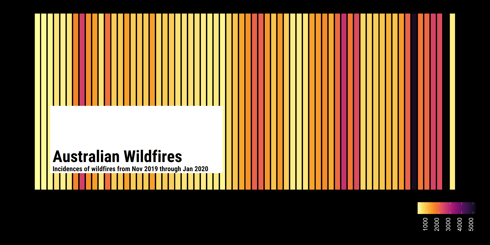

Week 2020/02: Australian Fires
================

``` r
raw_df <- tidytuesdayR::tt_load(2020, week = 2)
```

    ## --- Compiling #TidyTuesday Information for 2020-01-07 ----

    ## --- There are 11 files available ---

    ## --- Starting Download ---

    ## 
    ##  Downloading file 1 of 11: `fire_nrt_M6_94771.csv`
    ##  Downloading file 2 of 11: `IDCJAC0009_009151_1800_Data.csv`
    ##  Downloading file 3 of 11: `IDCJAC0009_023011_1800_Data.csv`
    ##  Downloading file 4 of 11: `IDCJAC0009_040383_1800_Data.csv`
    ##  Downloading file 5 of 11: `IDCJAC0009_040913_1800_Data.csv`
    ##  Downloading file 6 of 11: `IDCJAC0009_066062_1800_Data.csv`
    ##  Downloading file 7 of 11: `IDCJAC0009_070351_1800_Data.csv`
    ##  Downloading file 8 of 11: `IDCJAC0009_086232_1800_Data.csv`
    ##  Downloading file 9 of 11: `MODIS_C6_Australia_and_New_Zealand_7d.csv`
    ##  Downloading file 10 of 11: `rainfall.csv`
    ##  Downloading file 11 of 11: `temperature.csv`

    ## --- Download complete ---

``` r
raw_temp <- raw_df$temperature
raw_rain <- raw_df$rainfall
raw_fires <- raw_df$fire_nrt_M6_94771
```

What is the incidence of wildfires from 2019-11-01 01:20:00 to
2020-01-05 17:25:00?

This data is collected roughly every 1.5 hours, so lets count the number
of fires based on these time intervals:

``` r
data <-
raw_fires %>%
  # Select data where we can be pretty confident its a fire
  filter(confidence > 80) %>%
  mutate(date_time = ymd_hm(paste(acq_date, acq_time))) %>%
  select(date_time, everything()) %>%
  count(date_time) 


p <-
  ggplot() +
  geom_col(data = data, aes(x = date_time, y = n, colour = log(n), fill = log(n))) +
  coord_cartesian(ylim = c(0, 1)) +
  colorspace::scale_color_continuous_sequential(palette = "Inferno") +
  colorspace::scale_fill_continuous_sequential(palette = "Inferno") +
  guides(
    fill = FALSE,
    colour = FALSE
  ) +
  theme_void() +
  theme(
    plot.margin = margin(20, 20, 20, 20),
    plot.background = element_rect(fill = "#000000")
  )

title_df <-
  data.frame(
        xmin = ymd_hms("2019-11-03 01:20:00"),
        xmax = ymd_hms("2019-11-30 01:20:00"),
        ymin = c(0.1),
        ymax = c(0.5),
        x = ymd_hms("2019-11-03 01:20:00"),
        y = 0.17,
        label = "<span style='font-size:24pt'>**Australian Wildfires**</span><br><span style='font-size:10pt'>**Incidences of wildfires from Nov 2019 through Jan 2020**</span>")
   

p +
  geom_rect(
    data = title_df,
    aes(
    xmin = xmin, 
    xmax = xmax, 
    ymin = ymin, 
    ymax = ymax,
    ),
    fill = "#FFFFFF", 
    colour = NA, 
    alpha = 1) +
  geom_richtext(
    data = title_df,
    aes(
      x = x,
      y = y,
      hjust = 0,
      label = label
    ),
    fill = NA,
    label.colour = NA,
    family = "Roboto Condensed",
    colour = "black"
  )
```

<!-- -->

Bit messy; highly variable so difficult to get big picture overview….
What about if we bin by the day instead?

``` r
data <-
raw_fires %>%
  filter(confidence > 80) %>%
  count(acq_date)
```

``` r
p <-
  ggplot() +
  geom_col(data = data, aes(x = acq_date, y = n, fill = n), colour = "#000000") +
  coord_cartesian(ylim = c(0, 1)) +
  #colorspace::scale_color_continuous_sequential(palette = "Inferno") +
  colorspace::scale_fill_continuous_sequential(palette = "Inferno") +
  guides(
    #fill = FALSE
    #colour = FALSE
  ) +
  theme_void() +
  theme(
    plot.margin = margin(20, 20, 20, 20),
    plot.background = element_rect(fill = "#000000"),
    legend.position = "bottom",
    legend.justification = "right",
    legend.text = element_text(colour = "#FFFFFF", angle = 90, hjust = 0, vjust = 0)
  )

title_df <-
  data.frame(
        xmin = ymd("2019-11-03"),
        xmax = ymd("2019-11-30"),
        ymin = c(0.1),
        ymax = c(0.5),
        x = ymd("2019-11-03"),
        y = 0.17,
        label = "<span style='font-size:24pt'>**Australian Wildfires**</span><br><span style='font-size:10pt'>**Incidences of wildfires from Nov 2019 through Jan 2020**</span>")
   

p +
  geom_rect(
    data = title_df,
    aes(
    xmin = xmin, 
    xmax = xmax, 
    ymin = ymin, 
    ymax = ymax,
    ),
    fill = "#FFFFFF", 
    colour = NA, 
    alpha = 1) +
  geom_richtext(
    data = title_df,
    aes(
      x = x,
      y = y,
      hjust = 0,
      label = label
    ),
    fill = NA,
    label.colour = NA,
    family = "Roboto Condensed",
    colour = "black"
  )
```

<!-- -->
