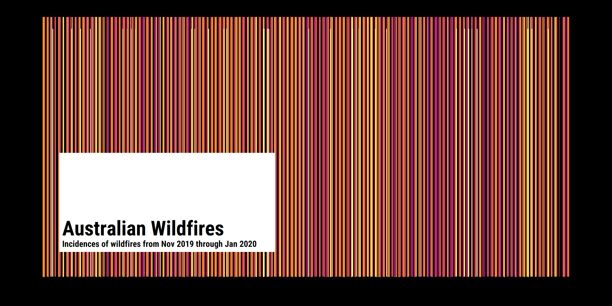

Week 2020/02: Australian Fires
================

``` r
raw_df <- tidytuesdayR::tt_load(2020, week = 2)
```

    ## --- Compiling #TidyTuesday Information for 2020-01-07 ----

    ## --- There are 11 files available ---

    ## --- Starting Download ---

    ## 
    ##  Downloading file 1 of 11: `fire_nrt_M6_94771.csv`
    ##  Downloading file 2 of 11: `IDCJAC0009_009151_1800_Data.csv`
    ##  Downloading file 3 of 11: `IDCJAC0009_023011_1800_Data.csv`
    ##  Downloading file 4 of 11: `IDCJAC0009_040383_1800_Data.csv`
    ##  Downloading file 5 of 11: `IDCJAC0009_040913_1800_Data.csv`
    ##  Downloading file 6 of 11: `IDCJAC0009_066062_1800_Data.csv`
    ##  Downloading file 7 of 11: `IDCJAC0009_070351_1800_Data.csv`
    ##  Downloading file 8 of 11: `IDCJAC0009_086232_1800_Data.csv`
    ##  Downloading file 9 of 11: `MODIS_C6_Australia_and_New_Zealand_7d.csv`
    ##  Downloading file 10 of 11: `rainfall.csv`
    ##  Downloading file 11 of 11: `temperature.csv`

    ## --- Download complete ---

``` r
raw_temp <- raw_df$temperature
raw_rain <- raw_df$rainfall
raw_fires <- raw_df$fire_nrt_M6_94771
```

``` r
data <-
raw_fires %>%
  filter(confidence > 80) %>%
  mutate(date_time = ymd_hm(paste(acq_date, acq_time))) %>%
  select(date_time, everything()) %>%
  count(date_time) 


p <-
  ggplot() +
  geom_col(data = data, aes(x = date_time, y = n, colour = log(n), fill = log(n))) +
  coord_cartesian(ylim = c(0, 1)) +
  colorspace::scale_color_continuous_sequential(palette = "Inferno") +
  colorspace::scale_fill_continuous_sequential(palette = "Inferno") +
  guides(
    fill = FALSE,
    colour = FALSE
  ) +
  theme_void() +
  theme(
    plot.margin = margin(20, 20, 20, 20),
    plot.background = element_rect(fill = "#000000")
  )

title_df <-
  data.frame(
        xmin = ymd_hms("2019-11-03 01:20:00"),
        xmax = ymd_hms("2019-11-27 01:20:00"),
        ymin = c(0.1),
        ymax = c(0.5),
        x = ymd_hms("2019-11-03 01:20:00"),
        y = 0.17,
        label = "<span style='font-size:24pt'>**Australian Wildfires**</span><br><span style='font-size:10pt'>**Incidences of wildfires from Nov 2019 through Jan 2020**</span>")
   

p +
  geom_rect(
    data = title_df,
    aes(
    xmin = xmin, 
    xmax = xmax, 
    ymin = ymin, 
    ymax = ymax,
    ),
    fill = "#FFFFFF", 
    colour = NA, 
    alpha = 1) +
  geom_richtext(
    data = title_df,
    aes(
      x = x,
      y = y,
      hjust = 0,
      label = label
    ),
    fill = NA,
    label.colour = NA,
    family = "Roboto Condensed",
    colour = "black"
  )
```

<!-- -->

``` r
raw_fires %>%
  filter(confidence > 80) %>%
  mutate(date_time = ymd_hm(paste(acq_date, acq_time))) %>%
  select(date_time, everything()) 
```

    ## # A tibble: 78,984 x 15
    ##    date_time           latitude longitude brightness  scan track acq_date  
    ##    <dttm>                 <dbl>     <dbl>      <dbl> <dbl> <dbl> <date>    
    ##  1 2019-11-01 01:20:00    -15.5      126.       361.   3.1   1.7 2019-11-01
    ##  2 2019-11-01 01:20:00    -15.5      126.       340.   3.1   1.7 2019-11-01
    ##  3 2019-11-01 01:20:00    -15.5      126.       351.   3.1   1.7 2019-11-01
    ##  4 2019-11-01 01:20:00    -15.5      126.       347.   3.1   1.7 2019-11-01
    ##  5 2019-11-01 01:20:00    -12.1      137.       337.   1     1   2019-11-01
    ##  6 2019-11-01 01:20:00    -12.1      137.       337.   1     1   2019-11-01
    ##  7 2019-11-01 01:20:00    -23.6      132.       354.   1     1   2019-11-01
    ##  8 2019-11-01 01:20:00    -23.6      132.       362.   1     1   2019-11-01
    ##  9 2019-11-01 01:20:00    -23.6      132.       348.   1     1   2019-11-01
    ## 10 2019-11-01 01:20:00    -12.5      132.       336.   1.2   1.1 2019-11-01
    ## # ... with 78,974 more rows, and 8 more variables: acq_time <chr>,
    ## #   satellite <chr>, instrument <chr>, confidence <dbl>, version <chr>,
    ## #   bright_t31 <dbl>, frp <dbl>, daynight <chr>

``` r
raw_fires %>%
  filter(acq_date == "2019-12-30")
```

    ## # A tibble: 6,926 x 14
    ##    latitude longitude brightness  scan track acq_date   acq_time satellite
    ##       <dbl>     <dbl>      <dbl> <dbl> <dbl> <date>     <chr>    <chr>    
    ##  1    -18.5      144.       330.   1.8   1.3 2019-12-30 0100     Terra    
    ##  2    -19.4      139.       348.   1     1   2019-12-30 0100     Terra    
    ##  3    -18.1      143.       328.   1.5   1.2 2019-12-30 0100     Terra    
    ##  4    -18.1      143.       341.   1.5   1.2 2019-12-30 0100     Terra    
    ##  5    -20.2      144.       332.   1.9   1.4 2019-12-30 0100     Terra    
    ##  6    -19.4      139.       336.   1     1   2019-12-30 0100     Terra    
    ##  7    -19.4      139.       331.   1     1   2019-12-30 0100     Terra    
    ##  8    -17.0      138.       340.   1     1   2019-12-30 0100     Terra    
    ##  9    -15.1      142.       331    1.1   1.1 2019-12-30 0100     Terra    
    ## 10    -16.7      136.       350.   1.3   1.1 2019-12-30 0100     Terra    
    ## # ... with 6,916 more rows, and 6 more variables: instrument <chr>,
    ## #   confidence <dbl>, version <chr>, bright_t31 <dbl>, frp <dbl>,
    ## #   daynight <chr>
