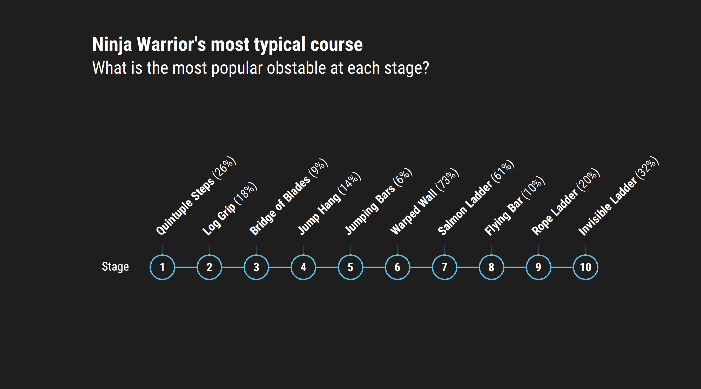

Week 2020/51: Ninja Warrior
================

``` r
extrafont::loadfonts(device="win")
```

    ## Registering font with R using windowsFonts(): Roboto Condensed

``` r
#extrafont::fonttable()
#extrafont::font_import("C:/Windows/Fonts/", pattern = "RobotoCondensed")

library(tidyverse)
```

    ## -- Attaching packages --------------------------------------- tidyverse 1.3.0 --

    ## v ggplot2 3.3.2     v purrr   0.3.4
    ## v tibble  3.0.4     v dplyr   1.0.2
    ## v tidyr   1.1.2     v stringr 1.4.0
    ## v readr   1.4.0     v forcats 0.5.0

    ## -- Conflicts ------------------------------------------ tidyverse_conflicts() --
    ## x dplyr::filter() masks stats::filter()
    ## x dplyr::lag()    masks stats::lag()

``` r
library(tidytext)
library(ggtext)
library(glue)
```

    ## 
    ## Attaching package: 'glue'

    ## The following object is masked from 'package:dplyr':
    ## 
    ##     collapse

``` r
raw_df <- tidytuesdayR::tt_load(2020, week = 51)
```

    ## Only 4 Github queries remaining until 2020-12-16 03:10:41 PM CST.

    ## Only 4 Github queries remaining until 2020-12-16 03:10:41 PM CST.
    ## Only 4 Github queries remaining until 2020-12-16 03:10:41 PM CST.
    ## Only 4 Github queries remaining until 2020-12-16 03:10:41 PM CST.
    ## Only 4 Github queries remaining until 2020-12-16 03:10:41 PM CST.

    ## --- Compiling #TidyTuesday Information for 2020-12-15 ----

    ## Only 3 Github queries remaining until 2020-12-16 03:10:41 PM CST.

    ## --- There is 1 file available ---

    ## Only 2 Github queries remaining until 2020-12-16 03:10:41 PM CST.

    ## --- Starting Download ---

    ## Only 2 Github queries remaining until 2020-12-16 03:10:41 PM CST.

    ##  Downloading file 1 of 1: `ninja_warrior.csv`

    ## Only 1 Github queries remaining until 2020-12-16 03:10:42 PM CST.

    ## --- Download complete ---

``` r
raw_df <- raw_df$ninja_warrior
```

``` r
raw_df
```

    ## # A tibble: 889 x 5
    ##    season location round_stage obstacle_name   obstacle_order
    ##     <dbl> <chr>    <chr>       <chr>                    <dbl>
    ##  1      1 Venice   Qualifying  Quintuple Steps              1
    ##  2      1 Venice   Qualifying  Rope Swing                   2
    ##  3      1 Venice   Qualifying  Rolling Barrel               3
    ##  4      1 Venice   Qualifying  Jumping Spider               4
    ##  5      1 Venice   Qualifying  Pipe Slider                  5
    ##  6      1 Venice   Qualifying  Warped Wall                  6
    ##  7      1 Venice   Semi-Finals Quintuple Steps              1
    ##  8      1 Venice   Semi-Finals Rope Swing                   2
    ##  9      1 Venice   Semi-Finals Rolling Barrel               3
    ## 10      1 Venice   Semi-Finals Jumping Spider               4
    ## # ... with 879 more rows

``` r
raw_df %>%
  distinct(round_stage)
```

    ## # A tibble: 8 x 1
    ##   round_stage               
    ##   <chr>                     
    ## 1 Qualifying                
    ## 2 Semi-Finals               
    ## 3 National Finals - Stage 1 
    ## 4 National Finals - Stage 2 
    ## 5 National Finals - Stage 3 
    ## 6 National Finals - Stage 4 
    ## 7 Qualifying (Regional/City)
    ## 8 Finals (Regional/City)

``` r
df <- raw_df %>%
  mutate(round_stage = case_when(
           str_detect(round_stage, "National Finals") ~ "National Finals",
           str_detect(round_stage, "Semi-Finals") ~ "Semi-Finals",
           str_detect(round_stage, "Finals") ~ "Finals",
           str_detect(round_stage, "Qualifying") ~ "Qualifying",
         )
  )
```

What are the 10 most popular obstacles?

``` r
df %>%
  count(round_stage, obstacle_name, name = "count") %>%
  arrange(desc(count)) %>%
  group_by(round_stage) %>%
  slice_max(count, n = 10, with_ties = FALSE) %>%
  ungroup() %>%
  mutate(obstacle_name = reorder_within(x = obstacle_name, by = count, within = round_stage)) %>%
  ggplot(aes(y = obstacle_name, x = count)) +
  geom_col(fill = "#57C1F1", colour = "white") +
  scale_y_reordered() +
  scale_x_continuous(expand = c(0,0)) +
  labs(
    title = "Ninja Warrior obstacles",
    subtitle = "What are the most popular obstacles by stage?",
    x = "Count",
    y = ""
  ) +
  facet_wrap(. ~ round_stage, scales = "free") +
  theme_minimal() +
  theme(
    plot.title = element_text(family = "Roboto Condensed", size = 18),
    plot.subtitle = element_text(family = "Roboto Condensed", size = 16),
    axis.text = element_text(family = "Roboto Condensed", size = 10),
    strip.text = element_text(family = "Roboto Condensed", size = 12, hjust = 0),
    axis.ticks = element_blank(),
    axis.ticks.x = element_blank(),
    panel.spacing = unit(0.5, "cm"),
    aspect.ratio = 1
  )
```

<!-- -->

What would a typical course look like?

``` r
# Where are the different obstacles?
df %>%
  group_by(obstacle_order, obstacle_name) %>%
  count() %>%
  ungroup() %>%
  group_by(obstacle_order) %>%
  mutate(pct = round((100 * n / sum(n)), 0)) %>%
  slice_max(pct, with_ties = FALSE) %>%
  ggplot(aes(x = obstacle_order, y = 1)) +
  geom_line(colour = "#57C1F1") +
  geom_segment(
    aes(x = obstacle_order, xend = obstacle_order, y = 1, yend = 2.1),
    colour = "#57C1F1",
    alpha = 0.25
  ) +
  geom_richtext(
    aes(
      x = obstacle_order, 
      y = 2.2,
      angle = 45,
      hjust = 0,
      vjust = 0,
      label = glue("**{obstacle_name}** ({pct}%)")
    ),
    colour = "#FFFFFF",
    fill = NA,
    label.colour = NA,
    family = "Roboto Condensed"
    ) +
  geom_point(size = 10, shape = 21, fill = "#1e1e1e", colour = "#57C1F1", stroke = 1) +
  geom_richtext(
    aes(
      x = obstacle_order, 
      y = 1, 
      label = glue("**{obstacle_order}**")
      ),
    vjust = 0.55,
    colour = "#FFFFFF",
    fill = NA,
    label.colour = NA,
    family = "Roboto Condensed"
  ) +
#  geom_richtext(
#    label = glue("<span style='font-family: \"Font Awesome 5 Free Solid\"'>&#62766; &#62650; &#62577;</span>"),
#    aes(x = 10, y = 1)
#  ) +
  theme_void() +
  theme(
    plot.background = element_rect(fill = "#1e1e1e", colour = "#1e1e1e"),
    plot.margin = margin(1, 3, 3, 3, "cm"),
    plot.title = element_text(family = "Roboto Condensed", size = 18, colour = "#FFFFFF", face = "bold"),
    plot.subtitle = element_text(family = "Roboto Condensed", size = 16, colour = "#FFFFFF"),
  ) +
  scale_y_continuous(
    limits = c(0, 10)
  ) +
  coord_cartesian(
    #ylim = c(0, 15),
    clip = "off"
  ) +
  labs(
    title = "Ninja Warrior's most typical course",
    subtitle = "What is the most popular obstable at each stage?"
  )
```

<!-- -->
