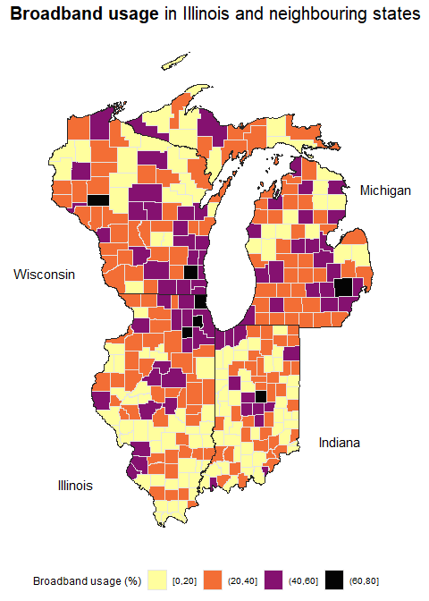

Week 2021/20 US Broadband
================

``` r
extrafont::loadfonts(device = "win")

library(sf) # Mapping
library(tigris) # Mapping
options(tigris_use_cache = TRUE)
options(tigris_class = "sf")

library(tidyverse)
library(here)
library(colorspace)
library(ggtext)

raw_df <- readr::read_csv("https://raw.githubusercontent.com/rfordatascience/tidytuesday/master/data/2021/2021-05-11/broadband.csv")
raw_df
```

    ## # A tibble: 3,143 x 5
    ##    ST    `COUNTY ID` `COUNTY NAME`   `BROADBAND AVAILABILITY P~ `BROADBAND USAG~
    ##    <chr>       <dbl> <chr>           <chr>                      <chr>           
    ##  1 AL           1001 Autauga County  0.81                       0.28            
    ##  2 AL           1003 Baldwin County  0.88                       0.30            
    ##  3 AL           1005 Barbour County  0.59                       0.18            
    ##  4 AL           1007 Bibb County     0.29                       0.07            
    ##  5 AL           1009 Blount County   0.69                       0.09            
    ##  6 AL           1011 Bullock County  0.06                       0.05            
    ##  7 AL           1013 Butler County   0.78                       0.11            
    ##  8 AL           1015 Calhoun County  0.93                       0.32            
    ##  9 AL           1017 Chambers County 0.82                       0.34            
    ## 10 AL           1019 Cherokee County 0.99                       0.10            
    ## # ... with 3,133 more rows

``` r
# Import county shapefiles
county_maps <- read_sf(here("2021/2021_05_11/county/"))

# Combine shapefiles with our original data
combined_df <-
county_maps %>%
  left_join(
    raw_df %>%
      janitor::clean_names() %>%
      mutate(
        COUNTYFP = as.character(county_id) %>% str_sub(., -3),
        STATEFP = as.character(county_id) %>% str_remove(string = ., pattern = ".{3}$") %>% str_pad(width = 2, side = "left", pad = "0")
      ),
    by = c("STATEFP", "COUNTYFP")
  )
```

``` r
combined_df %>%
  mutate(broadband_availability_per_fcc = as.numeric(broadband_availability_per_fcc),
         broadband_usage = as.numeric(broadband_usage)) %>%
  filter(st %in% c("IL", "WI", "MI", "IN")) %>%
  ggplot() +
  geom_sf(aes(geometry = geometry, fill = broadband_usage*100), colour = "grey90") +
  geom_sf(data = . %>% group_by(st) %>% summarise(), colour = "grey15", fill = NA) +
  coord_sf(crs = 4326, 
           expand = TRUE,
           clip = "off") +
  scale_fill_continuous_sequential(
    palette = "Inferno",
    name = "Broadband usage (%)",
    na.value = "grey90",
    labels = scales::label_number(accuracy = 1),
    guide = guide_colorbar(
     barwidth = unit(5, "cm"),
     frame.colour = "black",
     frame.linewidth = 1,
     frame.linetype = 1,
     draw.llim = FALSE,
     draw.ulim = FALSE
    )
  ) +
  annotate(geom = "text", x = -92, y = 38, label = "Illinois") +
  annotate(geom = "text", x = -83.5, y = 39, label = "Indiana") +
  annotate(geom = "text", x = -82, y = 45, label = "Michigan") +
  annotate(geom = "text", x = -93, y = 43, label = "Wisconsin") +
  labs(
    title = "**Broadband usage** in Illinois and neighbouring states"
  ) +
  ggthemes::theme_map() +
  theme(
    legend.position = "bottom",
    strip.background = element_blank(),
    panel.spacing = unit(0.5, "lines"),
    plot.title = element_markdown(hjust = 0.5, size = 15)
  )
```

    ## Warning in mask$eval_all_mutate(quo): NAs introduced by coercion

    ## Warning in mask$eval_all_mutate(quo): NAs introduced by coercion

<!-- -->

Binned plot:

``` r
combined_df %>%
  mutate(broadband_availability_per_fcc = as.numeric(broadband_availability_per_fcc),
         broadband_usage = as.numeric(broadband_usage),
         binned_usage = cut_width(broadband_usage*100, 20, boundary = 0)) %>%
  filter(st %in% c("IL", "WI", "MI", "IN")) %>%
  ggplot() +
  geom_sf(aes(geometry = geometry, fill = binned_usage), colour = "grey90") +
  geom_sf(data = . %>% group_by(st) %>% summarise(), colour = "grey15", fill = NA) +
  coord_sf(crs = 4326, 
           expand = TRUE,
           clip = "off") +
   scale_fill_discrete_sequential(
     palette = "Inferno",
     name = "Broadband usage (%)",
  #   na.value = "grey90",
  #   labels = scales::label_number(accuracy = 1),
  #   guide = guide_colorbar(
  #    barwidth = unit(5, "cm"),
  #    frame.colour = "black",
  #    frame.linewidth = 1,
  #    frame.linetype = 1,
  #    draw.llim = FALSE,
  #    draw.ulim = FALSE
  #   )
   ) +
  annotate(geom = "text", x = -92, y = 38, label = "Illinois") +
  annotate(geom = "text", x = -83.5, y = 39, label = "Indiana") +
  annotate(geom = "text", x = -82, y = 45, label = "Michigan") +
  annotate(geom = "text", x = -93, y = 43, label = "Wisconsin") +
  labs(
    title = "**Broadband usage** in Illinois and neighbouring states"
  ) +
  ggthemes::theme_map() +
  theme(
    legend.position = "bottom",
    strip.background = element_blank(),
    panel.spacing = unit(0.5, "lines"),
    plot.title = element_markdown(hjust = 0.5, size = 15)
  )
```

    ## Warning in mask$eval_all_mutate(quo): NAs introduced by coercion

    ## Warning in mask$eval_all_mutate(quo): NAs introduced by coercion

<!-- -->
