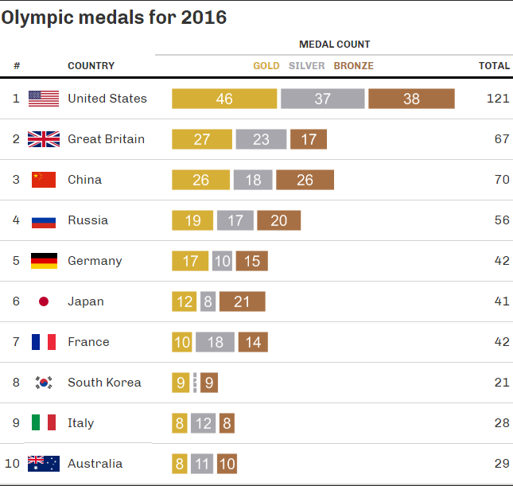

```{r setup, include=FALSE}
library(tidyverse)
library(magrittr)
library(gt)
library(magick)
library(countrycode)

raw_df <- readr::read_csv('https://raw.githubusercontent.com/rfordatascience/tidytuesday/master/data/2021/2021-07-27/olympics.csv')
```

```{r}
cleaned_df <- raw_df %>%
  filter(!is.na(medal), season == "Summer", year == 2016) %>%
  mutate(team = str_remove(team, "-1|-2")) %>%
  distinct(team, year, sport, event, medal) %>%
  count(year, team, medal) %>%
  complete(medal, nesting(team, year), fill = list(n = 0)) %>%
  arrange(year, team) %>%
  group_by(year, team) %>%
  add_count(wt = n, name = "total_medals") %>%
  ungroup() %>%
  mutate(max_medals = max(total_medals))

cleaned_df$medal <- factor(cleaned_df$medal, levels = c("Gold", "Silver", "Bronze"))

ranks <-   
  cleaned_df %>%
  pivot_wider(names_from = medal, values_from = n) %>%
  arrange(desc(Gold), desc(Silver), desc(Bronze)) %>%
  mutate(rank = row_number()) %>%
  select(team, rank, Gold, Silver, Bronze)

table_flags <-
cleaned_df %>% 
  distinct(team) %>%
  mutate(country_code = countrycode(sourcevar = team, origin = "country.name", destination = "iso2c") %>% stringr::str_to_lower(),
         flag_url = glue::glue("https://flagpedia.net/data/flags/mini/{ country_code }.png"))
```


```{r}
bar_fn <- function(df){
    df %>%
    ggplot(aes(x = n/max_medals, y = team, fill = fct_rev(medal))) +
    geom_bar(
      #position = "fill",
      stat = "identity",
      colour = "white",
      size = 20
    ) +
    geom_text(
      data = . %>% filter(n > 0),
      aes(x = n/max_medals, label = n, group = fct_rev(medal)),
      position = position_stack(vjust = .5),
      color = "white",
      #hjust = 0.5,
      size = 60,
      #family = "Lato"
    ) +
    theme_void() +
    theme(
      legend.position = "none"
    ) +
     scale_fill_manual(
       values = c("#A77044", "#A7A7AD", "#D6AF36"),
       aesthetics = c("fill")
     ) +
    coord_cartesian(
      xlim = c(0, 1)
    )
}

# dataframe with ggplots 
cleaned_df_gg <-
  cleaned_df %>%
  group_by(year, team) %>%
  mutate(
    across(-c("n", "medal"), unique),
    data = list(tibble(team = team, medal = medal, n = n, total_medals = total_medals, max_medals = max_medals) %>% bar_fn()),
    dummy = NA
  ) %>%
  ungroup() %>%
  distinct(team, year, data, dummy, total_medals)


# need to do this before calling gt() beaue we take the data again for the ggplot
cleaned_df_gg <-
  cleaned_df_gg %>%
  left_join(table_flags, by = "team") %>%
  left_join(ranks, by = "team") %>%
  select(rank, flag_url, team, dummy, data, total_medals) %>%
  arrange(rank) 

gt_object <-
  cleaned_df_gg %>%
  slice_head(n = 10) %>%
  gt() %>%
  tab_header(title = md("Olympic medals for 2016")) %>%
  text_transform(
    locations = cells_body(columns = vars(flag_url)),
    fn = function(x) {
      web_image(
        url = x,
        height = 20
      )
    }
  ) %>%
   text_transform(
    locations = cells_body(columns = c(dummy)),
    fn = function(x){
      #map(.$data, ggplot_image, height = px(10))
      cleaned_df_gg$data %>% map(ggplot_image, height = px(40), aspect_ratio = 9.9)
    }
  ) %>%
  cols_hide(c(data)) %>%
  cols_label(
    team = "Country",
    rank = "#"
  ) %>%
   tab_spanner(
     label = "Medal count", columns = 4:6
   ) %>% 
  opt_all_caps() %>% 
  opt_table_font(
    font = list(
      google_font("Chivo"),
      default_fonts()
    )
  ) %>% 
  tab_options(
    column_labels.border.top.width = px(3),
    column_labels.border.top.color = "#FFFFFF",
    table.border.top.color = "#FFFFFF",
    table.border.bottom.color = "#FFFFFF",
    data_row.padding = px(5),
  #  source_notes.font.size = 12,
    heading.align = "left") %>% 
  tab_style(
     locations = cells_column_labels(columns = everything()),
     style     = list(
       cell_borders(sides = "bottom", weight = px(3)),
       cell_text(weight = "bold")
     )
   ) %>% 
   tab_style(
     locations = cells_title(groups = "title"),
     style     = list(
       cell_text(weight = "bold", size = 24)
     )
   ) %>%
  cols_label(
    flag_url = "",
    total_medals = "TOTAL",
    dummy = html(
      "<span style='color:#D6AF36'><b>GOLD</b></span>",
      "&nbsp;&nbsp;",
      "<span style='color:#A7A7AD'><b>SILVER</b></span>",
      "&nbsp;&nbsp;",
      "<span style='color:#A77044'><b>BRONZE</b></span>"
    )
  ) %>%
  cols_width(
    dummy ~ px(400)
  )

#gtsave(gt_object, path = "D:/Dropbox/ds_projects/tidytuesday/2021/2021_07_27/", filename = "table_out.png")
#gt_object
```



```{r eval = FALSE}
# TODO: Create a shiny reactive table where you can choose year
#       Create paged table
#       Figure out why there are no plots for some countries

library(shiny)

# Here is a Shiny app (contained within
# a single file) that (1) prepares a
# gt table, (2) sets up the `ui` with
# `gt_output()`, and (3) sets up the
# `server` with a `render_gt()` that
# uses the `gt_tbl` object as the input
# expression

ui <- fluidPage(

  gt_output(outputId = "table")
)

server <- function(input,
                   output,
                   session) {

  output$table <-
    render_gt(
      expr = gt_object,
      height = px(600),
      width = px(600)
    )
}

if (interactive()) {
  shinyApp(ui, server)
}

```

