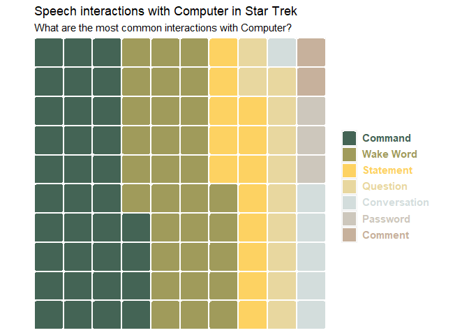

Week 2021/34 Star Trek Voice Commands
================

``` r
extrafont::loadfonts(device="win")

library(tidyverse)
library(waffle)
library(wesanderson)
library(ggtext)

raw_df <- readr::read_csv('https://raw.githubusercontent.com/rfordatascience/tidytuesday/master/data/2021/2021-08-17/computer.csv')
```

``` r
waffle_data <-
raw_df %>%
  select(char, char_type, interaction, type, pri_type, line, domain) %>%
  # Remove repeated commands
  distinct() %>%
  select(-interaction, -line) %>%
  mutate(char = if_else(str_detect(char, "Computer"), "Computer", char),
         type = stringr::str_to_title(type)) %>%
  filter(char_type == "Person") %>%
  count(type) %>%
  mutate(percent = n/sum(n) * 100) %>%
  arrange(desc(percent))

pal <- wes_palette("Chevalier1", 7, type = "continuous")
```

``` r
test <-
waffle_data %>%
  mutate(
    row_number = row_number(),
    colour = glue::glue("<span style = \"color:{ pal[row_number] }\">{ type }</span>")
    )
```

``` r
test %>%
  ggplot(aes(fill = fct_inorder(colour), values = percent)) +
  geom_waffle(n_rows = 10, colour = "white", make_proportional = TRUE, size = 1, radius = unit(2, "pt")) +
  theme_enhance_waffle() +
  scale_x_discrete(expand = c(0, 0)) +
  scale_y_discrete(expand = c(0, 0)) +
  labs(
    title = "Speech interactions with Computer in Star Trek",
    subtitle = "What are the most common interactions with Computer?",
    fill = "Interaction"
  ) +
  scale_fill_manual(values = pal) +
  theme(
    aspect.ratio = 1,
    legend.position = "right",
    legend.title = element_blank(),
    legend.text = element_textbox(size = 11, face = "bold")
  )
```

<!-- -->

``` r
test %>%
  ggplot(aes(fill = colour, values = percent)) +
  geom_waffle(n_rows = 10, colour = "white", make_proportional = FALSE, size = 1) +
  theme_minimal(base_family = "Roboto Condensed") +
  scale_x_discrete(expand = c(0, 0)) +
  scale_y_discrete(expand = c(0, 0)) +
  labs(
    title = "Speech interactions with Computer in Star Trek",
    subtitle = "What are the most common interactions between characters and Computer?",
    fill = "Interaction"
  ) +
  scale_fill_manual(values = pal) +
  theme(
    aspect.ratio = 1,
    legend.position = "none",
    strip.text = element_textbox()
  ) +
  facet_wrap(. ~ fct_reorder(type, -percent), nrow = 1)
```

<!-- -->

``` r
# TODO: simplify legend, colour-code the text, remove the squares
  # Think this is possible using ggtext, look into this
  # See https://stackoverflow.com/questions/60332202/conditionally-fill-ggtext-text-boxes-in-facet-wrap for potential solution
```
