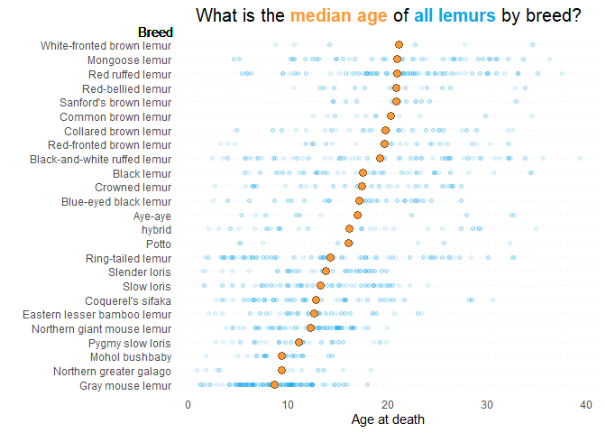
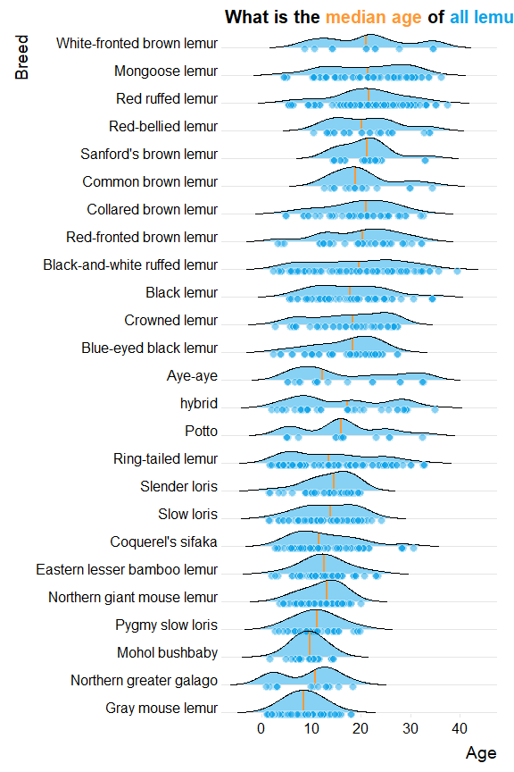
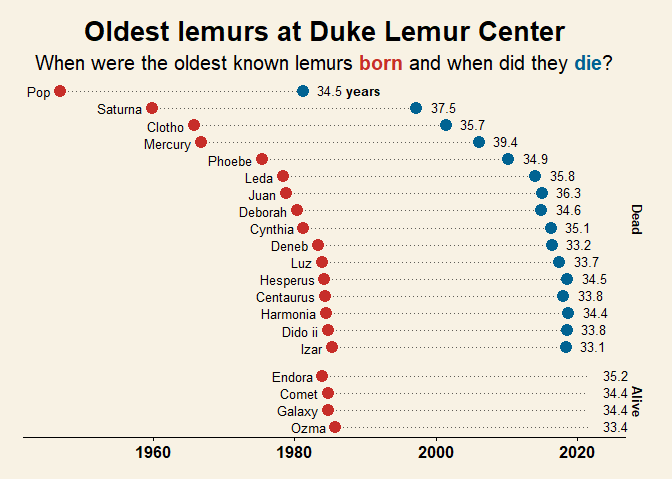
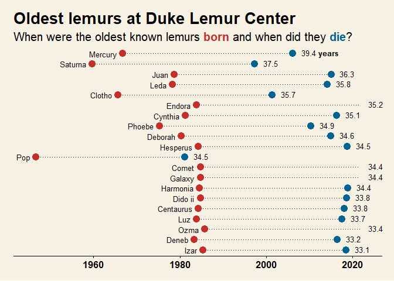

Week 2021/35 Lemurs
================

``` r
extrafont::loadfonts(device="win")

library(tidyverse)
library(ggthemes)
library(ggtext)

raw_df <- lemurs <- readr::read_csv('https://raw.githubusercontent.com/rfordatascience/tidytuesday/master/data/2021/2021-08-24/lemur_data.csv')
```

``` r
raw_df
```

    ## # A tibble: 82,609 x 54
    ##    taxon dlc_id hybrid sex   name      current_resident stud_book dob       
    ##    <chr> <chr>  <chr>  <chr> <chr>     <chr>            <chr>     <date>    
    ##  1 OGG   0005   N      M     KANGA     N                <NA>      1961-08-25
    ##  2 OGG   0005   N      M     KANGA     N                <NA>      1961-08-25
    ##  3 OGG   0006   N      F     ROO       N                <NA>      1961-03-17
    ##  4 OGG   0006   N      F     ROO       N                <NA>      1961-03-17
    ##  5 OGG   0009   N      M     POOH BEAR N                <NA>      1963-09-30
    ##  6 OGG   0009   N      M     POOH BEAR N                <NA>      1963-09-30
    ##  7 OGG   0009   N      M     POOH BEAR N                <NA>      1963-09-30
    ##  8 OGG   0010   N      M     EEYORE    N                <NA>      1964-05-20
    ##  9 OGG   0010   N      M     EEYORE    N                <NA>      1964-05-20
    ## 10 OGG   0014   N      F     ROOLETTE  N                <NA>      1964-10-27
    ## # ... with 82,599 more rows, and 46 more variables: birth_month <dbl>,
    ## #   estimated_dob <chr>, birth_type <chr>, birth_institution <chr>,
    ## #   litter_size <dbl>, expected_gestation <dbl>, estimated_concep <date>,
    ## #   concep_month <dbl>, dam_id <chr>, dam_name <chr>, dam_taxon <chr>,
    ## #   dam_dob <date>, dam_age_at_concep_y <dbl>, sire_id <chr>, sire_name <chr>,
    ## #   sire_taxon <chr>, sire_dob <date>, sire_age_at_concep_y <dbl>, dod <date>,
    ## #   age_at_death_y <dbl>, age_of_living_y <dbl>, age_last_verified_y <dbl>, ...

``` r
raw_df %>%
  # get rid of irrelevant columns and pull out distinct animals only
  select(-matches("weight|wt|days_before_death|preg|expected_gestation_d|age_category")) %>%
  distinct(across()) %>%
  ggplot(aes(x = age_at_death_y)) +
  geom_histogram(binwidth = 1, boundary = 0) +
  theme_minimal() + 
  scale_y_continuous(
    name = "# of Lemurs"
  ) +
  scale_x_continuous(
    name = "Age at death"
  ) +
  theme_minimal()
```

    ## Warning: Removed 827 rows containing non-finite values (stat_bin).

<!-- -->

``` r
formatted_df <-
raw_df %>%
  select(-matches("weight|wt|days_before_death|preg|expected_gestation_d|age_category")) %>%
  distinct(across()) %>%
  slice_max(age_at_death_y, n = 20) %>%
  select(name, dob, dod) %>%
  mutate(years_old = as.numeric((dod - dob)/365),
         name = str_to_sentence(name)) %>%
  pivot_longer(c(dob, dod), names_to = "date_type", values_to = "date") %>%
  arrange(date_type, desc(date)) 

formatted_df %>%
  ggplot(aes(x = date, y = fct_inorder(name))) +
  geom_line(linetype = 3) +
  geom_point(aes(colour = date_type), size = 5) +
  geom_text(data = . %>% filter(date_type == "dod"), 
            aes(x = (date + 1500), label = round(years_old, 1)),
            size = 4,
            hjust = "left") +
    geom_text(data = . %>% filter(date_type == "dob"), 
            aes(x = (date - 1500), label = name),
            size = 4,
            hjust = "right") +
  theme_minimal() +
  scale_y_discrete(
    name = "",
    expand = c(0, 0.1)
    ) + 
  scale_x_date(
    #expand = c(0, 0.1),
    name = "Date"
  ) +
  theme(
    axis.text.y = element_blank(),
    panel.grid = element_blank(),
    panel.grid.minor.x = element_blank(),
    #panel.grid.major.y = element_line(linetype = 3),
    legend.position = "none"
  ) +
  coord_cartesian(
    clip = "off"
  ) +
  annotate("text", x = min(formatted_df$date) + 1500, y = 21, label = "Born")
```

<!-- -->

Above is fine, but only includes animals which have died… what about
those that are still alive?

``` r
formatted_df <-
raw_df %>%
  select(-matches("weight|wt|days_before_death|preg|expected_gestation_d|age_category")) %>%
  distinct(across()) %>%
  select(name, dob, dod, age_at_death_y, age_of_living_y) %>%
  filter(!is.na(age_at_death_y) | !is.na(age_of_living_y)) %>%
  mutate(age = if_else(is.na(age_at_death_y), age_of_living_y, age_at_death_y)) %>%
  slice_max(age, n = 20) %>%
  mutate(name = str_to_sentence(name),
         type = if_else(is.na(dod), "Alive", "Dead"),
         # This is dummy value to make it easier to plot start/end of lines
         dod = if_else(is.na(dod), Sys.Date(), dod)
         ) %>%
  select(-age_at_death_y, -age_of_living_y) %>%
  pivot_longer(c(dob, dod), names_to = "date_type", values_to = "date") %>%
  arrange(type, date_type, desc(date))
```

``` r
# Annotations and labels (Most of this isn't used in current iteration)
ann_text <-
  data.frame(
    type = rep("Dead",2),
    lab = c("<span style='color:#C72E29'>**Born**</span>", "<span style='color:#016392'>**Died**</span>"),
    x = as.Date(c("1953-01-01", "1974-01-01")),
    xend = as.Date(c(min(formatted_df$date), "1981-03-05")),
    y = c(17.5, 17.5),
    yend = c(16.45, 16.45),
    curv = c(0.5, -0.5),
    col = c("#C72E29", "#016392")
  )

ann_text
```

    ##   type                                         lab          x       xend    y
    ## 1 Dead <span style='color:#C72E29'>**Born**</span> 1953-01-01 1946-10-01 17.5
    ## 2 Dead <span style='color:#016392'>**Died**</span> 1974-01-01 1981-03-05 17.5
    ##    yend curv     col
    ## 1 16.45  0.5 #C72E29
    ## 2 16.45 -0.5 #016392

``` r
formatted_df %>%
  mutate(label = if_else(name == "Pop", glue::glue("{round(age,1)} **years**"), as.character(round(age,1)))) %>%
  ggplot(aes(x = date, y = fct_inorder(name))) +
  geom_line(linetype = 3, colour = "#5E5C56") +
  geom_point(data = . %>% filter(type == "Dead"), aes(colour = date_type), size = 4) +
  geom_point(data = . %>% filter(type == "Alive" & date != Sys.Date()), aes(colour = date_type), size = 4) +
  facet_grid(fct_rev(type) ~ ., scales = "free", space = "free") +
  geom_richtext(data = . %>% filter(date_type == "dod"), 
            aes(x = (date + 500), label = label),
            size = 3.5,
            hjust = "left",
            fill = NA,
            label.colour = NA) +
  geom_text(data = . %>% filter(date_type == "dob"), 
            aes(x = (date - 500), label = name),
            size = 3.5,
            hjust = "right") +
  #theme_minimal() +
  theme_wsj(title_family = "sans") +
  scale_y_discrete(
    name = "",
   # expand = c(0, 0.1)
    ) + 
  scale_x_date(
    #expand = c(0, 0.1),
    name = ""
  ) +
  coord_cartesian(
    clip = "off"
  ) + 
  # #https://stackoverflow.com/questions/55627528/how-can-i-pass-individual-curvature-arguments-in-ggplot2-geom-curve-functi
  # lapply(split(ann_text, 1:nrow(ann_text)), function(dat) {
  #   geom_curve(data = dat, aes(x = x, y = y-0.25, xend = xend, yend = yend), 
  #              curvature = dat["curv"],    
  #              arrow = arrow(length = unit(0.2, "cm")),
  #              lineend = "round"
  #              ) }
  # ) +
  # geom_richtext(
  #   data = ann_text,
  #   aes(x = x, y = y, label = lab),
  #   label.colour = NA,
  #   vjust = 0.5,
  #   fill = "#F8F2E4"
  # ) +  
  labs(
    title = "Oldest lemurs at Duke Lemur Center",
    subtitle = "When were the oldest known lemurs <span style='color:#C72E29'>**born**</span> and when did they <span style='color:#016392'>**die**</span>?"
  ) +
  scale_colour_manual(
    values = c("#C72E29", "#016392")
  ) +
  theme(
    axis.text.y = element_blank(),
    panel.grid.major.y = element_blank(),
    panel.grid.minor.x = element_blank(),
    legend.position = "none",
    plot.title = element_markdown(size = 20),
    plot.subtitle = element_markdown(size = 15),
    strip.background = element_blank(),
    strip.text = element_textbox(face = "bold", fill = "#000000") # Fill isn't working... 
  ) 
```

<!-- -->

Ordered by age:

``` r
formatted_df %>%
  arrange(age) %>%
  mutate(label = if_else(name == "Mercury", glue::glue("{round(age,1)} **years**"), as.character(round(age,1)))) %>%
  ggplot(aes(x = date, y = fct_inorder(name))) +
  geom_line(linetype = 3) +
  geom_point(data = . %>% filter(type == "Dead"), aes(colour = date_type), size = 4) +
  geom_point(data = . %>% filter(type == "Alive" & date != Sys.Date()), aes(colour = date_type), size = 4) +
 # facet_grid(fct_rev(type) ~ ., scales = "free", space = "free", drop = TRUE) +
  geom_richtext(data = . %>% filter(date_type == "dod"), 
            aes(x = (date + 500), label = label),
            size = 3.5,
            hjust = "left",
            fill = NA,
            label.colour = NA) +
    geom_text(data = . %>% filter(date_type == "dob"), 
            aes(x = (date - 500), label = name),
            size = 3.5,
            hjust = "right") +
  #theme_minimal() +
  theme_wsj(title_family = "sans") +
  scale_y_discrete(
    name = "",
   # expand = c(0, 0.1)
    ) + 
  scale_x_date(
    #expand = c(0, 0.1),
    name = ""
  ) +
  coord_cartesian(
    clip = "off"
  ) + 
  labs(
    title = "Oldest lemurs at Duke Lemur Center",
    subtitle = "When were the oldest known lemurs <span style='color:#C72E29'>**born**</span> and when did they <span style='color:#016392'>**die**</span>?"
  ) +
  scale_colour_manual(
    values = c("#C72E29", "#016392")
  ) +
  theme(
    axis.text.y = element_blank(),
    panel.grid.major.y = element_blank(),
    panel.grid.minor.x = element_blank(),
    legend.position = "none",
    plot.title = element_markdown(size = 20),
    plot.subtitle = element_markdown(size = 15),
    strip.text = element_textbox()
  ) 
```

<!-- -->
