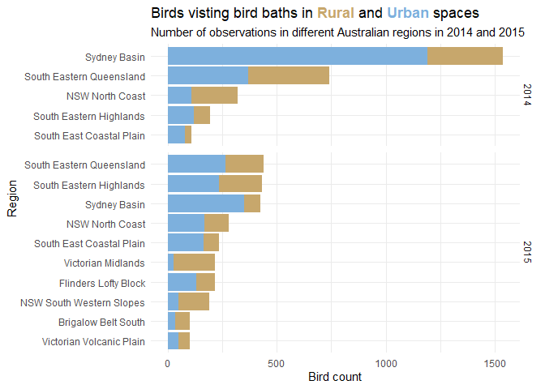
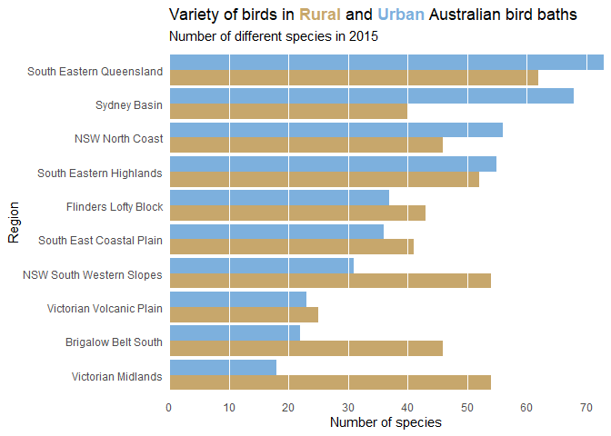

Week 2021/36 Bird Baths
================

``` r
library(tidyverse)
library(tidytext)
library(colorspace)
library(ggtext)

raw_df <-  readr::read_csv('https://raw.githubusercontent.com/rfordatascience/tidytuesday/master/data/2021/2021-08-31/bird_baths.csv')
raw_df
```

    ## # A tibble: 161,057 x 5
    ##    survey_year urban_rural bioregions               bird_type         bird_count
    ##          <dbl> <chr>       <chr>                    <chr>                  <dbl>
    ##  1        2014 Urban       South Eastern Queensland Bassian Thrush             0
    ##  2        2014 Urban       South Eastern Queensland Chestnut-breaste~          0
    ##  3        2014 Urban       South Eastern Queensland Wild Duck                  0
    ##  4        2014 Urban       South Eastern Queensland Willie Wagtail             0
    ##  5        2014 Urban       South Eastern Queensland Regent Bowerbird           0
    ##  6        2014 Urban       South Eastern Queensland Rufous Fantail             0
    ##  7        2014 Urban       South Eastern Queensland Spiny-cheeked Ho~          0
    ##  8        2014 Urban       South Eastern Queensland Flame Robin                0
    ##  9        2014 Urban       South Eastern Queensland European Goldfin~          0
    ## 10        2014 Urban       South Eastern Queensland Noisy Friarbird            0
    ## # ... with 161,047 more rows

``` r
raw_df %>%
  count(bioregions, urban_rural, survey_year, wt = bird_count) %>%
  filter(!is.na(bioregions)) %>%
  mutate(bioregions = tidytext::reorder_within(bioregions, n, survey_year)) %>%
  ggplot(aes(x = n, y = bioregions, fill = urban_rural)) +
  geom_bar(stat = "identity") +
  facet_grid(survey_year ~ ., scales = "free_y", space = "free_y") +
  theme_minimal() +
  tidytext::scale_y_reordered(
    name = "Region"
    ) +
  scale_fill_discrete_qualitative(palette = "Harmonic", name = "") +
  scale_x_continuous(
    name = "Bird count"
  ) +
  theme(
    legend.position = "none",
    plot.title = element_markdown()
  ) +
  labs(
    title = "Birds visting bird baths in <span style='color:#C7A76C'>**Rural**</span> and <span style='color:#7DB0DD'>**Urban**</span> spaces",
    subtitle = "Number of observations in different Australian regions in 2014 and 2015"
    
  )
```

<!-- -->

``` r
raw_df %>%
  filter(bird_count > 0, survey_year == 2015) %>%
  distinct(survey_year, bioregions, bird_type, urban_rural) %>%
  count(bioregions, urban_rural) %>%
  add_count(bioregions, wt = n) %>% # Count number of different species
  arrange(fct_rev(urban_rural), n) %>% # Order data for plot
  ggplot(aes(y = fct_inorder(bioregions), x = n, fill = urban_rural)) +
  geom_col(position = position_dodge())  +
  scale_fill_discrete_qualitative(palette = "Harmonic", name = "") +
  scale_x_continuous(
    name = "Number of species",
    expand = c(0, 0),
    breaks = seq(0, 70, 10)
  ) +
  scale_y_discrete(
    name = "Region"
  ) +
  theme_minimal() +
  theme(
    panel.grid.major.x = element_line(linetype = 1, size = 0.5, colour = "#FFFFFF"),
    panel.grid.minor.x = element_blank(),
    panel.grid.major.y = element_blank(),
    panel.ontop = TRUE,
    plot.title = element_markdown(),
    legend.position = "none"
  ) +
  labs(
    title = "Variety of birds in <span style='color:#C7A76C'>**Rural**</span> and <span style='color:#7DB0DD'>**Urban**</span> Australian bird baths",
    subtitle = "Number of different species in 2015"
  )
```

    ## Storing counts in `nn`, as `n` already present in input
    ## i Use `name = "new_name"` to pick a new name.

<!-- -->
